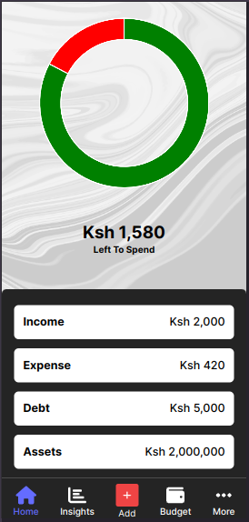
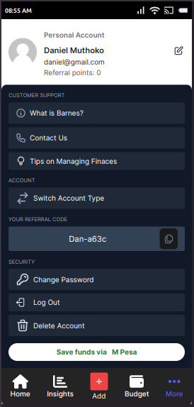

# Barnes Budgeting Application

## Table of Contents
- [Problem Statement](#problem-statement)
- [Key Features](#key-features)
- [Launching](#launching)
- [Prerequisites](#prerequisites)
- [Installations](#installations)
  - [Backend](#backend)
  - [Frontend](#frontend)
- [Usage](#usage)
- [Development Notes](#development-notes)
- [Security Considerations](#security-considerations)
- [MVPs](#mvps)
- [Technologies Used](#technologies-used)
- [License](#license)
- [Contributors](#contributors)

## Features
- ## User Roles
The app allows a user to choose between having a personal account or business account.
  - ## Personal Account:
Can manage their debts, savings, assets, incomes and expenses as well as gain referral points.
  - ## Business Account: 
Can manage revenues, assets and expenses.

Barnes App is a user-friendly budget tracker application that provides separate dashboards for personal and business finances, allowing users to monitor and manage income, expenses, assets, savings goals, and debts.

 ‎ ‎ ‎ ‎ ‎ ‎ ‎ 

## Problem Statement

Many individuals and small business owners struggle to manage their finances effectively due to the complexity of tracking income, expenses, assets, savings goals, and debts. The challenge is often compounded when personal and business finances are intertwined, leading to a lack of clarity and control over financial health.
There is a need for an intuitive and comprehensive budget tracking solution that can provide clear visibility into both personal and business financial activities, helping users make informed decisions, achieve savings goals, and manage debts efficiently.

## Key Features

1. **Income Tracking:**
   - Personal and business income categorization.
   - Recurring and one-time income sources.
   - Income trend analysis.

2. **Expense Management:**
   - Categorization of expenses (e.g., utilities, rent, supplies).
   - Budget setting and tracking for different categories.
   - Alerts for overspending in specific categories.Sharon Byegon

3. **Asset Management:**
   - Tracking of personal and business assets (e.g., properties, equipment).
   - Valuation updates and depreciation tracking.

4. **Savings Goals:**
   - Goal setting for savings (e.g., emergency fund, business expansion).
   - Progress tracking and milestone achievements.
   - Automated suggestions for reaching savings goals faster.

5. **Debt Management:**
   - Tracking of personal and business debts (e.g., loans, credit cards).
   - Payment schedules and reminders.
   - Debt payoff strategies and projections.

6. **Separate Dashboards:**
   - Clear distinction between personal and business finances.
   - Customizable dashboards for quick insights and detailed views.
   - Integration of financial data from different sources.

7. **Reporting and Analytics:**
   - Monthly, quarterly, and annual financial summaries.
   - Detailed reports on spending, income, and asset performance.
   - Predictive analytics for future financial planning.

8. **Security and Privacy:**
   - Data encryption and secure authentication.
   - Compliance with financial data protection regulations.

## Launching
## ENDPOINTS:
1. ## User Authentication and Authorization Endpoints
Purpose: Handles user registration, login and logout.
 - POST /api.add_resource(UserResource, '/users', '/users/<int:id>'): /patient 

  - Description: Registers a new user in the system.
  - Request Body: { username,first_name,last_name, date_of_birth, contact_number, email,password }
  - Response: { success: true, message: "User registered        successfully" }

- POST /api.add_resource(Login, '/login'): /login

  - Description: Logs in a user.
  - Request Body: { username, password, email }
  - Response: { success: true, token: "Login successful" }

- POST /api.add_resource(Logout, '/logout'): /logout

  - Description: Logs out the patient by invalidating the current JWT token.
  - Authorization: Bearer token in headers.
  - Response: { success: true, message: "Logged out successfully" }

2. ##  Insights Management Endpoints
Purpose: Handles CRUD operations related to incomes and expenses.

- POST /api.add_resource(IncomeResource, '/incomes',): /incomes

  - Description: Creates an income transaction.
  - Request Body: { amount, userId, description, date, category_id,}
  - Response: { success: true, message: "Income transaction added" }

- POST /api.add_resource(ExpenseResource, '/expenses',): /expenses

  - Description: Creates an expense transaction.
  - Request Body: {amount, category_id, userID, date, description}
  - Response: { success: true, message: "Expense transaction added" }

3. ##  Category Endpoints
Purpose: Handles CRUD operations related to Categories.

- GET /api.add_resource(IncomeCategoryResource,'/income_categories', '/income_categories/<int:id>')

  - Description: Retrieves the categories for income transactions.
  - Response: { success: true, message: "Categories retrieves" }

- POST /api.add_resource(ExpenseCategoryResource, '/categories', '/categories/<int:id>')

  - Description: Creates a new expense category
  - Response: { success: true, message: "Category successfully created" }

4. ##  Assets Endpoint
Purpose: Handles CRUD operations related to Assets.

- POST /api.add_resource(AssetResource, '/assets', '/assets/<int:id>')

  - Description: Creates a new asset in the system.
  - Request Body: { name ,amount ,description}
  - Response: { success: true, message: "Asset added successfully" }

5. ## Budget Endpoints

- POST /api.add_resource(SavingsGoalResource, '/savings', '/savings/<int:id>')

  - Description: Creates new savings goals.
  - Response: { success: true, message: "Savings goal created successfully" }

 POST /api.add_resource(DebtResource, '/debts', '/debts/<int:id>')

  - Description: Creates debt to manage/pay off.
  - Response: { success: true, message: "Debt added successfully" }  

  ## Additional Considerations
    - Error Handling: Implement robust error handling for each endpoint to provide meaningful error messages and status codes.
    - Validation (login page): Validate incoming data to ensure it meets expected formats and criteria.

## Prerequisites:
- React
- Tailwind
- Python
- MySQL
- An active database  and client side connection.

## Installations:
- ## Backend:
  - Ensure atleast python 3.8.13 is installed in your system.
  - Install required packages using pip:
        pip install MySQL, sqlalchemy_serializer, flask_bcrypt and any other incase the app requires.

- ## Frontend:
  - Ensure Reactjs is installed in your system.
  - Ensure Vite is installed

## To run Barnes locally, follow these steps:
1. ## Clone the repository:
      git clone https://github.com/iankuria668/phase5-project.git
      cd phase5-project
2. ## Client side
  -  To download the dependencies for the frontend client, run:
           npm install --prefix client;
  - You can run your React app on localhost:3000 by running: 
            npm start --prefix client

  - Check that your the React client displays a default page  http://localhost:5173/. You should see a web page with the heading "Barnes".   

3. ## Open another terminal: Run Server side.
  - Install dependencies:
      pipenv install

  - Set up environment:    
      pipenv shell

4. ## Run the application:
      cd server
      python seed.py
      python app.py

5. ## Access the application:
- Open your web browser and go to 'http://localhost:5173/' to use Barnes.
## Usage
- ## Personal Account:
  1. Register or login.
  2. Plan your savings, debts and limits.
  3. View personal/ business financial records.
  4. Send out your referral code to get referral points

- ## Business Account: 
  1. Register or login.
  2. Plan your savings, debts and limits.
  3. View personal/ business financial records.

## Development Notes:
- ~ client~: Contains  the frontend code built with React.js.
- ~ server~: Contains the backend code built with MySQL(python)
- ~ models~: Defines Flask app db schemas using MySQL.
- ~ routes~: Defines API routes for authentication
- ~config~: Configuration files including database connection setup.

## Security Considerations:

  - Use of hashing for secure authentication and authorization.
  - Input validation and sanitization to prevent security vulnerabilities.

## MVPs

### MVP: Budget Tracking

1. **Basic Income and Expense Tracking:** Simple categorization and visualization of income and expenses.
2. **Separate Dashboards:** Initial implementation of separate dashboards for personal and business finances.
3. **Savings Goals Setup:** Basic goal setting and tracking feature.
4. **Debt Tracking:** Simple debt recording and payment reminders.
5. **Basic Reporting:** Monthly summaries of financial activities.

## Technologies Used

### Backend
- **Language**: Python, JavaScript (Node.js)
- **Framework**: Flask
- **Database**: MySQL
- **Authentication**: JWT (JSON Web Tokens) or OAuth

### Frontend
- **Language**: JavaScript
- **Framework**: React
- **Routing**: React Router

### Development Tools
- **Version Control**: Git and GitHub
- **Package Management**: npm
- **Build Tools**: Create React App

## Contributors

- [Tulley](https://github.com/two23three)
- [Kuria](https://github.com/iankuria668)
- [Mwachi](https://github.com/MwachiOfficial)
- [Bill](https://github.com/Bjoseph23)
- [Andy](https://github.com/Muny1re1)
- [George](https://github.com/migeroreloaded)
- [Mariya](https://github.com/mariyaschrome)
- [Sharon](https://github.com/B-Sharon)
